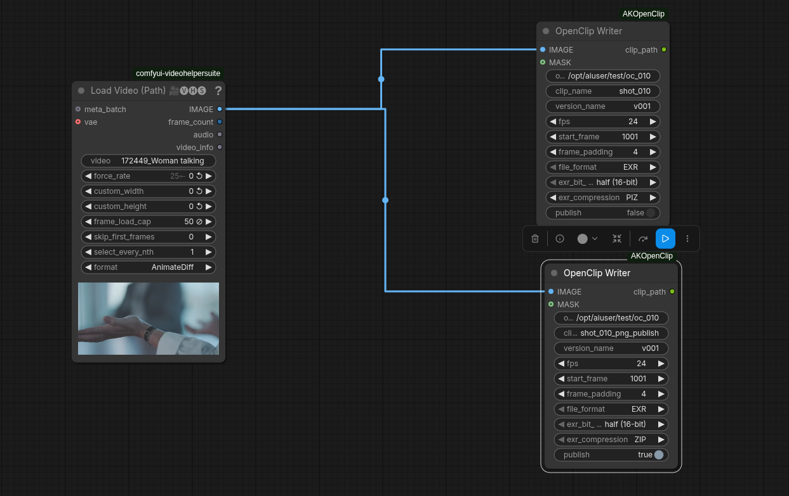
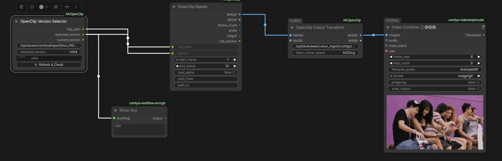

# ComfyOpenClip

OpenClip read/write nodes for ComfyUI, designed for VFX pipelines that use Autodesk Flame.

Frames rendered in ComfyUI are written as versioned OpenClip packages that Flame can import directly from its MediaHub. Clips exported from Flame can be read back into ComfyUI for processing. The full round-trip preserves versioning, frame ranges, and colour space metadata.

---

## Nodes

### OpenClip Writer
Writes an image sequence and generates a `.clip` XML manifest that Flame can import.

- Outputs EXR (half or float, ZIP / PIZ / DWAB compression) or PNG sequences
- Each run adds a new version to an existing clip rather than overwriting it
- Mismatched resolution or frame rate raises an error before writing anything
- Optional **Publish** mode attaches the active ComfyUI workflow JSON as a sidecar file alongside the image sequence

### OpenClip Reader
Reads any version from an existing `.clip` file and returns an IMAGE and MASK tensor batch.

- Supports OpenClip v8 and v9
- **path_from / path_to** fields remap embedded media paths for clips copied between machines (airgap / network mount scenarios)
- Auto-remap mode: leave `path_from` empty and the reader probes the filesystem to find the media relative to the clip file

### OpenClip Version Selector
Inspects a `.clip` file and lets you pick a version before wiring it into the Reader.

- **Refresh & Check** button reads the clip live and shows the current version
- Pass `selected_version` directly into the Reader's `version` input

### OpenClip Colour Transform
Converts the Reader's linear output to `Rec.1886 Rec.709 - Display` using an OCIO config.

- Auto-detects the Flame OCIO config at `/opt/Autodesk/colour_mgmt/configs/flame_configs/`
- Falls back to the `$OCIO` environment variable if set
- The OCIO config field is editable — point it at any valid config
- MASK passes through unchanged

---

## Screenshots

**Write workflow** — load a video and write it as an OpenClip package in two formats simultaneously:



**Read workflow** — select a version, read the clip, apply a colour transform, and preview:



---

## Requirements

- ComfyUI
- `lxml` — XML parse and serialise
- `OpenImageIO` — EXR and PNG I/O
- `opencolorio` — OCIO colour transforms (only required for the Colour Transform node)

Install dependencies:
```bash
pip install lxml openimageio opencolorio
```

---

## Installation

**Via ComfyUI Manager** (recommended once a release is published):
add the repo URL in the Manager's custom node installer.

**Manual:**
```bash
cd ComfyUI/custom_nodes
git clone https://github.com/janklier/ComfyOpenClip.git
```

Restart ComfyUI. The four nodes appear under the **OpenClip** category.

---

## Package layout on disk

The Writer always produces a **Standard Flame** layout:

```
<output_dir>/
  <clip_name>/
    <clip_name>.clip                          ← OpenClip XML manifest
    versions/
      v001/
        <clip_name>.1001.exr                  ← image sequence
        <clip_name>.1002.exr
        <clip_name>.v001.comfy.json           ← workflow sidecar (publish only)
      v002/
        ...
```

This matches what Flame produces on its own exports, so the folder can be scanned directly from the Flame MediaHub.

---

## Notes

- XML is written as OpenClip v8, which is the current Flame interchange format.
- The output colour space for the Colour Transform node is hardcoded to `Rec.1886 Rec.709 - Display` to match what Flame expects on import.
- Flame users can point the OCIO config field at their project config, typically found at `/opt/Autodesk/colour_mgmt/configs/flame_configs/<version>/aces2.0_config/config.ocio`.
