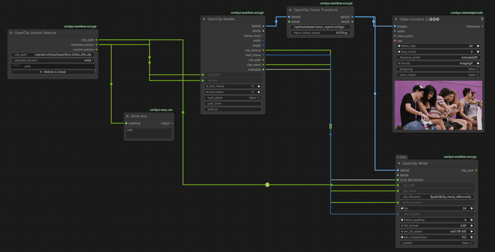

# ComfyOpenClip

OpenClip read/write nodes for ComfyUI, designed for VFX pipelines that use Autodesk Flame.

Frames rendered in ComfyUI are written as versioned OpenClip packages that Flame can import directly from its MediaHub. Clips exported from Flame can be read back into ComfyUI for processing. 

---

## Nodes

### OpenClip Writer
Writes an image sequence and generates a `.clip` XML manifest that Flame can import.

- Outputs EXR (half or float, ZIP / PIZ / DWAB compression) or PNG sequences
- Each run adds a new version to an existing clip rather than overwriting it
- Mismatched resolution or frame rate raises an error before writing anything
- Optional **Publish** mode attaches the active ComfyUI workflow JSON as a sidecar file alongside the image sequence
- **clip_path** and **clip_name** inputs can be wired directly from the Reader to keep the same destination folder and clip name without retyping
- **clip_filename** pattern field (default `$(path)/$(clip_name).clip`) supports `$(path)` and `$(clip_name)` tokens, so prefixes and suffixes can be added with minimal typing (e.g. `$(path)/$(clip_name)_grade.clip`). Path segments with `..` are resolved, so `$(path)/../processed/$(clip_name).clip` works as expected. The expanded name is used for both the `.clip` file and the media sequence filenames.
- Optional **CLIP_METADATA** input: when wired from the Reader, EXR header metadata from the source clip (tape name, timecodes, scene/take, etc.) is carried through and written into the output files

### OpenClip Reader
Reads any version from an existing `.clip` file and returns an IMAGE and MASK tensor batch.

- Supports OpenClip v8
- **path_from / path_to** fields remap embedded media paths for clips copied between machines (airgap / network mount scenarios)
- Auto-remap mode: leave `path_from` empty and the reader probes the filesystem to find the media relative to the clip file
- Outputs **start_frame**, **clip_path**, and **clip_name** for direct wiring into the Writer to preserve frame numbering, folder, and clip name across a round-trip
- Outputs **CLIP_METADATA** — a dict of EXR header attributes from the first frame, ready to wire into the Writer

### OpenClip Version Selector
Inspects a `.clip` file and lets you pick a version before wiring it into the Reader.

- Outputs **available_versions** — a newline-separated list of every version in the clip, with the current one marked; wire it to a text-preview node to see valid values before typing `selected_version`
- Outputs **current_version** — the version marked `currentVersion` in the XML
- Pass `selected_version` directly into the Reader's `version` input

### OpenClip Colour Transform
Converts the Reader's linear output to `Rec.1886 Rec.709 - Display` using an OCIO config.

- Auto-detects the Flame OCIO config at `/opt/Autodesk/colour_mgmt/configs/flame_configs/`
- Falls back to the `$OCIO` environment variable if set
- The OCIO config field is editable — point it at any valid config
- MASK passes through unchanged

---

## Screenshot

**Full round-trip** — select a version, read the clip, apply a colour transform, preview, then write back with frame numbering, folder, clip name, and EXR metadata all carried through automatically:



---

## Requirements

| Package | Purpose | Required |
|---|---|---|
| `lxml` | XML parse and serialise | Always |
| `openimageio` | EXR and PNG I/O | Always |
| `opencolorio` | OCIO colour transforms | Colour Transform node only |

**ComfyUI Manager** installs all dependencies automatically from `requirements.txt` when you install the node pack — no manual steps needed.

**Manual install:**
```bash
pip install -r requirements.txt
```

If you don't need the Colour Transform node, `opencolorio` can be skipped — the other three nodes will load and run without it.

---

## Installation

**Via ComfyUI Manager** (recommended once a release is published):
add the repo URL in the Manager's custom node installer.

**Manual:**
```bash
cd ComfyUI/custom_nodes
git clone https://github.com/janklier/ComfyOpenClip.git
```

Restart ComfyUI. The four nodes appear under the **OpenClip** category.

---

## Notes

- XML is written as OpenClip v8, which is the current Flame interchange format.
- The output colour space for the Colour Transform node is hardcoded to `Rec.1886 Rec.709 - Display` to match what Flame expects on import.
- Flame users can point the OCIO config field at their project config, typically found at `/opt/Autodesk/colour_mgmt/configs/flame_configs/<version>/aces2.0_config/config.ocio`.
