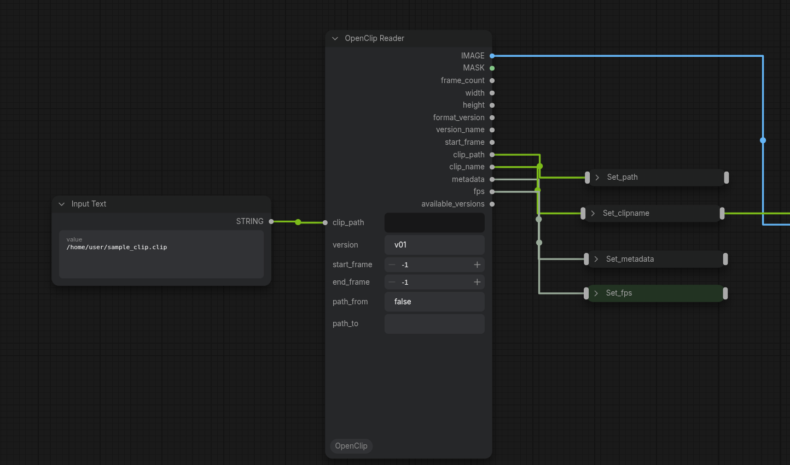
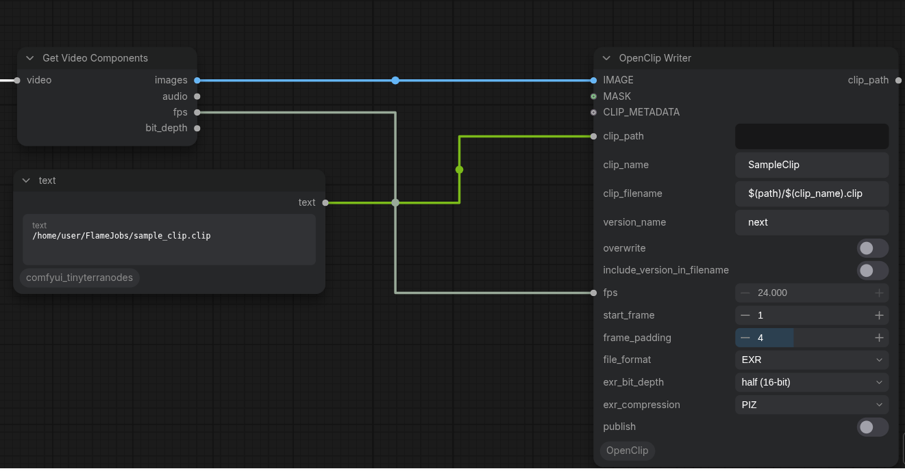
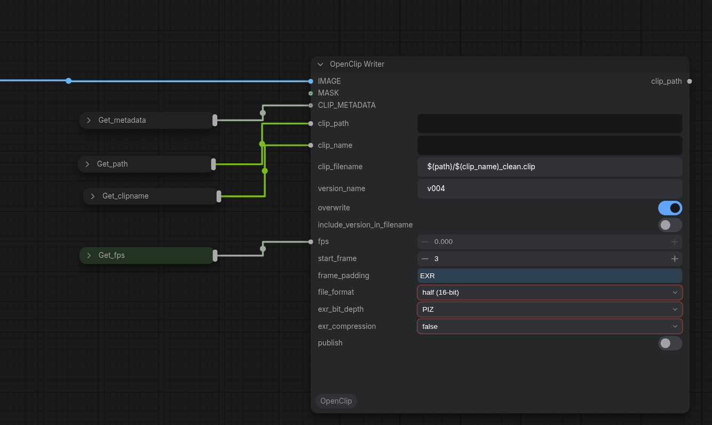
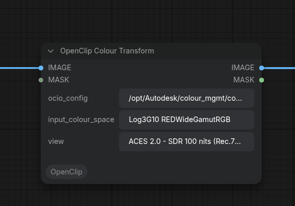

# ComfyOpenClip

OpenClip read/write nodes for ComfyUI, designed for VFX pipelines that use Autodesk Flame, but also other apps that handle OpenClips like Nuke and Baselight.

Frames rendered in ComfyUI are written as versioned OpenClip packages that Flame can import directly from its MediaHub. Clips exported from Flame can be read back into ComfyUI for processing. 

---

## Quick Start

The easist way to use these nodes is to add a OpenClip Reader node at the beginning of the workflow. Point it at an existing .clip file rendered from Frame, leave version as 'current', and use the Image output.

Then at the end of the workflow add a OpenClip Writer node, connecting the finished image into the Image input. Leave the vesion on the 'next' default, pipe the clip_path, clip_name, metadata, and fps values through from the reader, add "_updated" at the end of the clip_name pattern in the OpenClip Writer and all should be well.

The rest are options for more advanced workflows.

If a specific version should be read, rather than 'current'. Attach a Preview Text node to the 'available versions' output of teh reader and 'run' it. That will list all available version names. Pick one and copy/paste it into the 'version' input.

## Nodes

### OpenClip Writer
Writes an image sequence and generates a `.clip` XML manifest that Flame can import.

At the top level based on path there is the .clip XML manifest.
It has a versions subfolder, which contains a folder of EXR files per version present.

Various options can be set to configure the clip and the EXR file generation. If the OpenClips are used in a round-trip scenario from Flame, many parameters can be piped through from the read node. (see example 1 in screenshots below).

The write node has the follwing inputs/settings:

- Image: takes an image sequence (if the workflow generates video rather than image batch, use a 'Get Video Components' node to extract an image bath and accompanying parameters).
- Mask: An alpha channel to go with the EXR files.
- ClipMetadata: The standard text structure for metadata. The most common use case is to pipe it through from the read node to maintain all metadata in the pipeline.
- clip_path: where the open clip files will be stored.
- clip_name: Logical ClipName.
- clip_filename: filename of the .clip file. This uses a pattern, referencing the other clip settings to construct the full filename. Default is: $(path)/$(clip_name).clip.
- version_name: the text string of the version. the default of 'next' will allocate the next version, or start with v001.
- overwrite: whether existing versions are allowed to be overwritten. If the latest version is 'v003', and the version_name is also set to 'v003', the existing version 'v003' will be deleted an a new version will be written. If disabled, writing an existing version number results in an error.
include_version_in_filename: whether to include the 'v003' version in the EXR filenaming convention. As each version is written into separate folders, this is option, but common practice in some pipelines.
fps: the frame rate to place into the clip metadata.
start_frame: the number of the first written frame
frame_padding: how many zeros to put into front of short frame numbers.
file_format: choose between EXR and PNG
exr_bit_depth: EXR specific.
exr_compression: EXR specific.
publihs: if selected, a copy of the json file of the current ComfyUI workflow will be copied into the version folder.

### OpenClip Reader
Reads any version from an existing `.clip` file and returns an IMAGE and MASK tensor batch. Also owns version browsing/selection — there is no separate selector node.

The reader node has the following inputs/settings:

- clip_path: the full filename of the .clip file to be read.
- version: the version to be read (defaults to 'current', based on which version is marked as current in .clip file)
- end_frame/start_frame: select a specific frame range to be read

The node as the following outputs:

- Image: the image batch read from the file.
- Mask: the alpha channel read from the file.
- frame_count: the number of frames read.
- width/height: the dimensions of the canvas.
- format_version: the version of the OpenClip XML file. Latest is version 9 (with Flame 2027.1).
- clip_path: the path fo the .clip file that was read.
- clip_name: the name of the clip that was read.
- metadata: the metadata values read.
- fps: frame rate indicated in the file.
- available_version: a text output of available versions in the file.

### OpenClip Colour Transform

Applies an OCIO view transform to make log and camera spaces compatible with models that have been trained on BT1886/Rec709 footage.

Insert after the reader and before the rest of the workflow.

When installed on Flame workstations, it will default to the ACES 2.0 OCIO config that ships with flame, usually located at `/opt/Autodesk/colour_mgmt/configs/flame_configs/`.

It falls back to the `$OCIO` environment variable if set

---

## Screenshots

Several screenshots showing latest version of the nodes in action. There are two versions of the write node, one that is paired with the read node, the other that is independent on a brand new open clip file generated by a workflow.






---

## Requirements

| Package | Purpose | Required |
|---|---|---|
| `lxml` | XML parse and serialise | Always |
| `openimageio` | EXR and PNG I/O | Always |
| `opencolorio` | OCIO colour transforms | Colour Transform node only |

**ComfyUI Manager** installs all dependencies automatically from `requirements.txt` when you install the node pack — no manual steps needed.

**Manual install:**
```bash
pip install -r requirements.txt
```

If you don't need the Colour Transform node, `opencolorio` can be skipped — the other two nodes will load and run without it.

---

## Installation

**Via ComfyUI Manager** (recommended once a release is published):
add the repo URL in the Manager's custom node installer.

**Manual:**
```bash
cd ComfyUI/custom_nodes
git clone https://github.com/allklier/ComfyUI_OpenClip.git
```

Restart ComfyUI. The three nodes appear under the **OpenClip** category.

---

## Notes

- XML is always written as OpenClip v8
- The Colour Transform node's `view` input defaults to `ACES 2.0 - SDR 100 nits (Rec.709)` to match what Flame expects on import, but any view exposed by the OCIO config can be used instead.
- Flame users can point the OCIO config field at their project config, typically found at `/opt/Autodesk/colour_mgmt/configs/flame_configs/<version>/aces2.0_config/config.ocio`.
